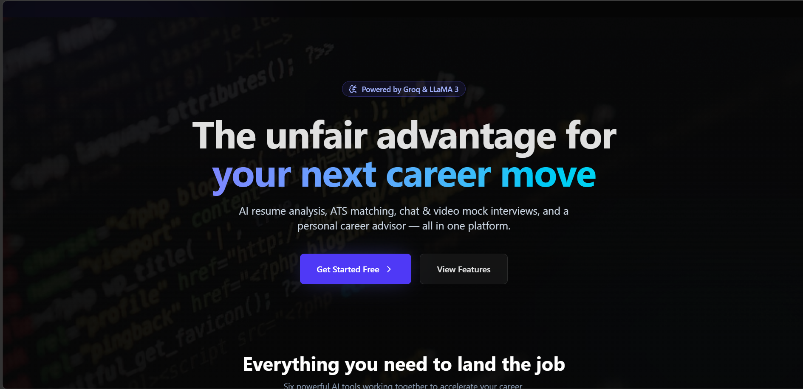
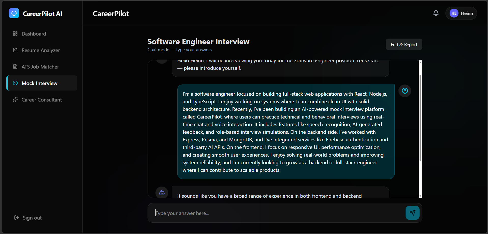
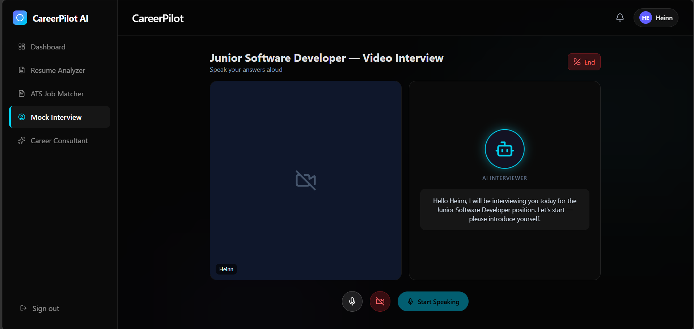
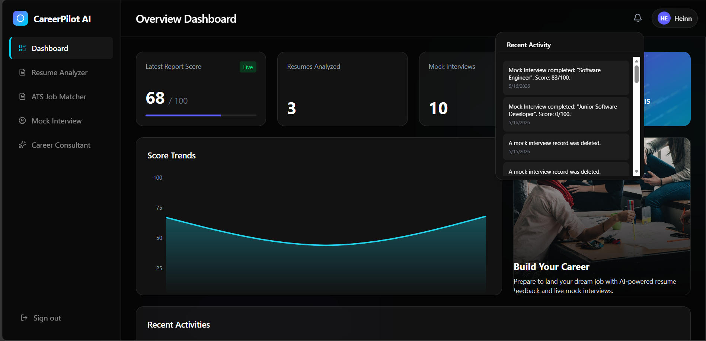

<div align="center">

# 🚀 CareerPilot AI — Smart Career Development Platform


### AI-Powered Resume Analysis, Mock Interviews, ATS Optimization & Career Preparation

[](https://react.dev/)
[](https://www.typescriptlang.org/)
[](https://nodejs.org/)
[](https://firebase.google.com/)
[](https://mongodb.com/)
[](https://render.com/)
[](LICENSE)

### 🌐 Live Demo
https://careerpilot-o9ih.onrender.com

<p>
  <h3>StartUp Screen</h3>
  
</p>
<p>
  <h3>Chat Interview Mode</h3>
  
</p>
<p>
  <h3>Video Interview Mode</h3>
  
</p>
<p>
  <h3>Dashboard & Results</h3>
  
</p>
---

### ✨ Features
🤖 AI Resume Analysis • 🎤 AI Mock Interviews • 📄 ATS Resume Scoring • 🔐 Secure Authentication • 🌍 Responsive UI • ☁️ Full Deployment

---

</div>

# 📌 About CareerPilot AI

CareerPilot AI is a modern full-stack AI-powered career development platform that helps users prepare for jobs more effectively using artificial intelligence.

The platform combines:

- AI Resume Analysis
- ATS Resume Scoring
- AI Mock Interviews
- Authentication System
- Career Dashboard
- Real-Time AI Feedback

Users can upload resumes, receive AI-generated improvement suggestions, practice interviews, and improve job readiness through an interactive experience.

---

# ✨ Core Features

## 🤖 AI Resume Analysis

- Upload resume files
- AI analyzes resume quality
- Detects weak sections
- Provides improvement suggestions
- Highlights missing skills
- Gives professional feedback

---

## 📄 ATS Resume Scoring

- Simulates Applicant Tracking System scoring
- Measures resume optimization
- Detects keyword matching
- Gives ATS compatibility score
- Suggests ATS improvements

---

## 🎤 AI Mock Interviews

- AI-generated interview questions
- Real-time interview interaction
- Technical & behavioral questions
- AI evaluation system
- Smart feedback generation
- Multiple job role support

---

## 🔐 Authentication System

### Email & Password Authentication
- Secure registration
- Login system
- JWT authentication

### Google Authentication
- Firebase Google Sign-In
- One-click authentication

### Forgot Password System
- OTP email verification
- Secure password reset
- Email-based recovery flow

---

## 📊 User Dashboard

- Resume analysis history
- Interview history
- User progress tracking
- Performance overview
- Personalized experience

---

## 🎨 Modern UI/UX

- Fully responsive design
- Smooth animations with Framer Motion
- Modern glassmorphism styling
- Dark theme interface
- Mobile-friendly layout

---

# 🛠 Tech Stack

# Frontend

- React 18
- TypeScript
- Vite
- Tailwind CSS
- Framer Motion
- React Router DOM
- Lucide React

---

# Backend

- Node.js
- Express.js
- JWT Authentication
- Firebase Admin SDK
- Prisma ORM

---

# Database

- MongoDB Atlas

---

# AI & APIs

- Groq API
- AI-powered analysis generation
- Resume evaluation system

---

# Authentication

- Firebase Authentication
- Google OAuth
- JWT Tokens

---

# Deployment

- Docker
- Render
- GitHub

---

# 📂 Project Structure

```bash
CareerPilot/
│
├── prisma/
│   └── schema.prisma
│
├── src/
│   ├── components/
│   ├── pages/
│   │   ├── Auth.tsx
│   │   ├── Dashboard.tsx
│   │   ├── ResumeAnalyzer.tsx
│   │   ├── MockInterview.tsx
│   │   └── ...
│   │
│   ├── App.tsx
│   └── main.tsx
│
├── server/
│   ├── routes/
│   ├── middleware/
│   └── ...
│
├── dist/
├── dist-server/
├── package.json
├── vite.config.ts
├── Dockerfile
└── README.md
```

---

# 🚀 Getting Started

# 1️⃣ Clone Repository

```bash
git clone https://github.com/Koheinn/CareerPilot.git

cd CareerPilot
```

---

# 2️⃣ Install Dependencies

```bash
npm install
```

---

# 3️⃣ Create Environment Variables

Create a `.env` file in the root directory:

```env
# =========================
# APP CONFIG
# =========================
PORT=3000
NODE_ENV=development

# =========================
# DATABASE
# =========================
MONGO_URL=your_mongodb_connection_string

# =========================
# AUTH
# =========================
JWT_SECRET=your_super_secure_secret

# =========================
# FIREBASE
# =========================
VITE_FIREBASE_API_KEY=your_firebase_api_key

FIREBASE_SERVICE_ACCOUNT_KEY=your_full_service_account_json

# =========================
# AI
# =========================
GROQ_API_KEY=your_groq_api_key

# =========================
# EMAIL
# =========================
RESEND_API_KEY=your_resend_api_key
```

---

# 4️⃣ Run Development Server

```bash
npm run dev
```

---

# 🌐 Open in Browser

```bash
http://localhost:5173
```

---

# 🐳 Docker Deployment

## Build Docker Image

```bash
docker build -t careerpilot .
```

---

## Run Docker Container

```bash
docker run -p 3000:3000 careerpilot
```

---

# ☁️ Deploy on Render

## 1️⃣ Push Project to GitHub

```bash
git add .

git commit -m "Production deployment"

git push origin main
```

---

## 2️⃣ Create Render Web Service

- Go to Render
- New Web Service
- Connect GitHub repository
- Select Docker environment

---

## 3️⃣ Add Environment Variables

Add all `.env` variables inside Render dashboard.

Important variables:

```env
NODE_ENV=production
PORT=3000
MONGO_URL=your_mongodb_url
JWT_SECRET=your_secret
GROQ_API_KEY=your_key
RESEND_API_KEY=your_key
VITE_FIREBASE_API_KEY=your_key
```

---

## 4️⃣ Deploy

Render automatically builds and deploys the application.

---

# 🐳 Production Dockerfile

```Dockerfile
# ===============================
# BUILD STAGE
# ===============================
FROM node:20-alpine AS builder

WORKDIR /app

COPY package*.json ./
COPY prisma ./prisma/

RUN npm ci

COPY . .

RUN npx prisma generate
RUN npm run build

# ===============================
# PRODUCTION STAGE
# ===============================
FROM node:20-alpine

WORKDIR /app

ENV NODE_ENV=production

RUN apk add --no-cache openssl

COPY package*.json ./
COPY prisma ./prisma/

RUN npm ci --omit=dev

# Frontend build
COPY --from=builder /app/dist ./dist

# Backend build
COPY --from=builder /app/dist-server ./dist-server

# Prisma runtime
COPY --from=builder /app/node_modules/.prisma ./node_modules/.prisma
COPY --from=builder /app/node_modules/@prisma/client ./node_modules/@prisma/client

EXPOSE 3000

CMD ["npm", "start"]
```

---

# 🔒 Security Features

- JWT Authentication
- Firebase Authentication
- Secure API Routes
- Protected Dashboard
- Password Encryption
- OTP Password Recovery
- Environment Variable Protection

---

# 📸 Screenshots

## Authentication
- Login
- Register
- Google Sign-In
- Forgot Password

## Dashboard
- Resume Analysis
- ATS Scores
- Interview Reports

## AI Interview
- AI-generated questions
- Interactive interview system
- Real-time feedback

---

# 📈 Performance

- ⚡ Fast Vite frontend
- ⚡ Optimized Docker deployment
- ⚡ Production-ready architecture
- ⚡ Responsive UI
- ⚡ Lazy-loaded frontend build

---

# 🧠 Future Improvements

- AI Resume Builder
- Real-time voice interviews
- Video interview recording
- AI job recommendations
- Resume templates
- Multi-language support
- Team recruiter dashboard

---

# 🤝 Contributing

Contributions are welcome.

## Steps

```bash
Fork repository

Create new branch

Commit changes

Push branch

Open Pull Request
```

---

# 📄 License

This project is licensed under the MIT License.

---

# 👨‍💻 Developer

### Heinn Htet Zan

Full-Stack Developer passionate about:
- AI Applications
- Modern Web Development
- UI/UX Design
- Scalable Backend Systems

---

<div align="center">

# ⭐ Star This Repository

If you found this project useful, please give it a star on GitHub ⭐

---

### Built with ❤️ using React, TypeScript, Node.js, Firebase & AI

</div>
